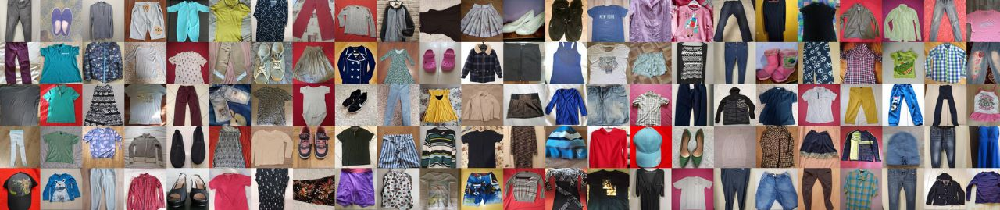
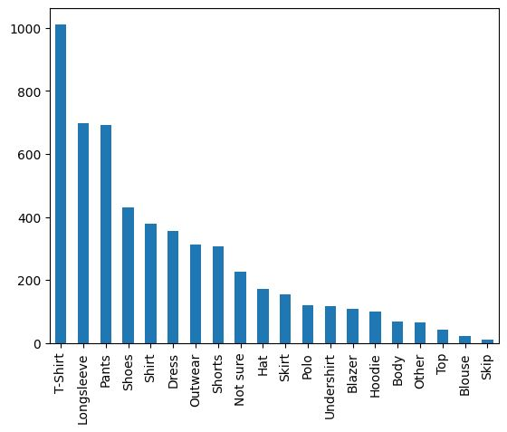
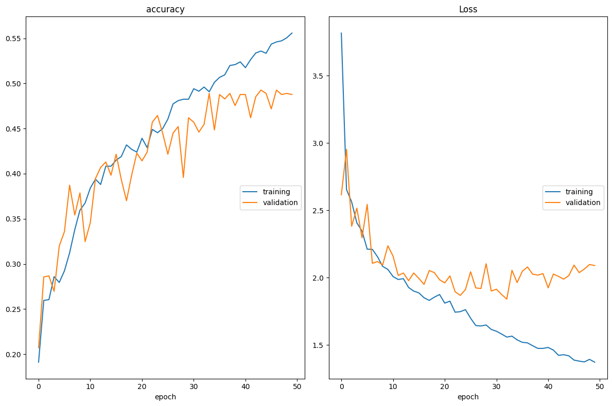
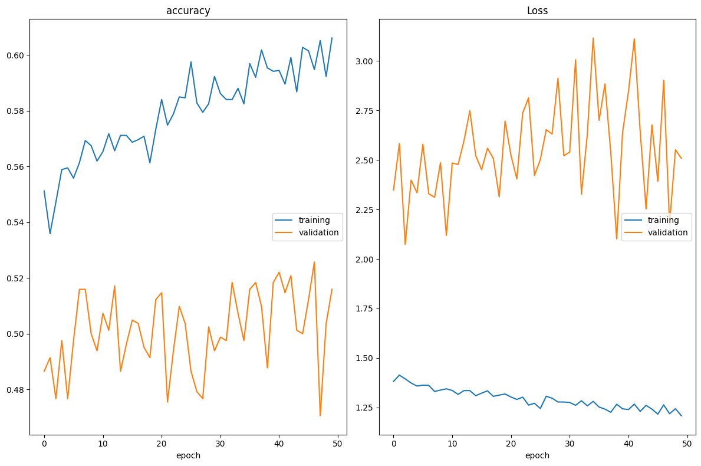
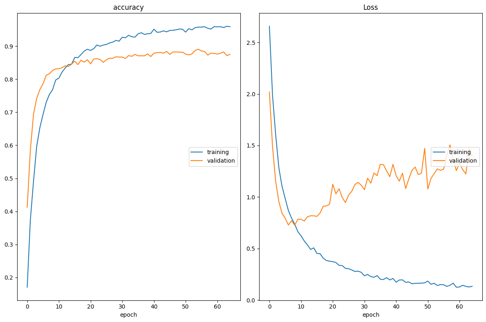

# Task 2 Clothing articles classifier  
## Results on the test set
| Model                 | input_size | Accuracy | Params (M) | FLOPs (M) | MACC (M) |                                                                                         weights                                                                                         |
|-----------------------|:----------:|:--------:|:-------------:|:------------:|:-----------:|:---------------------------------------------------------------------------------------------------------------------------------------------------------------------------------------:|
| Baseline              |    224     |   46 %   |      2.9      |    4415.9    |   2207.9    | [weights](https://uottawa-my.sharepoint.com/personal/kataa028_uottawa_ca/_layouts/15/guestaccess.aspx?docid=00e804f4a57704c0f94447a4418c42796&authkey=AWEJbTCAoUnnIodAol-vB58&e=RVGABg) |
| Baseline_class_wights |    224     |   49 %   |      2.9      |    4415.9    |   2207.9    | [weights](https://uottawa-my.sharepoint.com/personal/kataa028_uottawa_ca/_layouts/15/guestaccess.aspx?docid=05f322888f02a4d7e8f4bc3ca28c413fb&authkey=AZALgV2cgTSBaBuySbIjAME&e=7CvnuZ) |
| EfficientNet          |    224     |  92  %   |     6.06      |    771.84    |    385.9    |                                                                                       [weights](https://uottawa-my.sharepoint.com/personal/kataa028_uottawa_ca/_layouts/15/guestaccess.aspx?docid=0bae61e4f3dca44d38cfba4e1658f934d&authkey=AaZ18tlHYFDVpPZDM1XylOg&e=Jhz83F)                                                                                       |
## Dataset 
The dataset consists of Over 5,000 images of 20 different classes. 
This dataset can be downloaded form Kaggle [Download full version](https://www.kaggle.com/datasets/agrigorev/clothing-dataset-full/download?datasetVersionNumber=1) 
The full data is large, but I only worked on the compressed version which is the same but resized and you can download it from [Download compressed version](https://uottawa-my.sharepoint.com/personal/kataa028_uottawa_ca/_layouts/15/guestaccess.aspx?docid=0d3c10b53fac347778b8acc79b1cb6cd6&authkey=AWDWIlHspTaqcus0fpcfe10&e=Hz3Vg2) 
You should put the dataset folders in the same directory with the notebook.

## Data distribution and labels
 
## Data preprocessing
-   Check for missing images
-   Editing paths of images in the CSV file by adding jpg extension
-   Check for label distribution
-   Drop rows that have unimportant labels such as [ "Not sure", "skip", "Other" ]
-   Splitting the dataset into training, validation and testing sets
## Data Loading
-   Starting to organize the data by creating directories for each class for training and testing sets 
-   Loading the dataset using ImageDataGenerator
-   For augmentation, I used ImageDataGenerator to generate new images by applying random transformations to the original images and limit each class to 500 images
## Model Architectures
### 1. Baseline Model
Creating a baseline model with 3 convolutional blocks. Each block contains convolutional, Batch Normalization and maxpooling layers, 1 fully connected layer and output layer with softmax activation function. Also creating a callback to save the best model among all epochs.

#### Model Evaluation
We evaluated the model with the test dataset and it achieved 0.46 accuracy. 
Accroding to the class inbalnce this is the confusion matrix to see the model performance for each class. 
 
we can notice that the model is biased to the classes 6 (Longsleeve) ,8 (Pants), 14(T-shirts) and this expected because these are the majority classes in the dataset  
so, it is not performing well, and we need to improve it.
### 2. Baseline with handling class imbalance by giving more weight to the classes that have less images 
To handle class imbalance, I used class_weight parameter in the fit method to give more weight to the classes that have less images.
Also we used the same previous model architecture.

#### Model Evaluation
We evaluated the model with the test dataset and it achieved 0.49 accuracy.
we can notice that the accuracy now can be used as an accurate metric accurate because of classes balance. 
But we should look at the confusion matrix to see the model performance for each class. 
 
We can notice that there is a varity of the true predicted classes through the diagonal of the matrix,
but still very low ,so this is because of architecture  
I will use transfer learning with data augmentation to achieve better results.
### 3. Transfer Learning using effiecientnetB0 with data augmentation
I used transfer learning with effiecientnetB0 model and data augmentation to improve the model performance.
For augmentation, I used ImageDataGenerator to generate new images by applying random transformations to the original images and limit each class to 500 images.
Also I used EarlyStopping callback to stop training if the model is not improving and model checkppoint callback to save the best model.

There is small overfitting, but I saved the best weights which achieved the highest accuracy on the validation set.
#### Model Evaluation
We evaluated the model with the test dataset and it achieved 0.92 accuracy. 
This is the confusion matrix to see the model performance for each class.
 
**We can notice that the model is performing well for all classes.**

## Calculating FLOPS and MACCs per layer 
## Baseline model FLOPs and MACCs

### EfficheintnetB0 model
|     Layer Name |      Input Shape |     Output Shape |      Kernel Size |          Filters | Strides |           FLOPS |            MACC |
|---------------:|-----------------:|-----------------:|-----------------:|-----------------:|--------:|----------------:|----------------:|
|          conv2d |  [224, 224, 3]  | [222, 222, 128]  |          (3, 3)  |             128  |   (1, 1) |       346816512 |       173408256 |
|        conv2d_1 |[111, 111, 128]  | [109, 109, 128]  |          (3, 3)  |             128  |   (1, 1) |      3633610752 |      1816805376 |
|        conv2d_2 |  [54, 54, 128]  |    [52, 52, 64]  |          (3, 3)  |              64  |   (1, 1) |       429981696 |       214990848 |
|          flatten|          43,264 |             [64] |          [0, 0]  |          [0, 0]  |   [1, 1] |         5537792 |         2768896 |
|            dense|              64 |             [17] |          [0, 0]  |          [0, 0]  |   [1, 1] |            2176 |            1088 |

|   Layer Name       | Input Shape    | Output Shape   | Kernel Size | Filters | Strides |      FLOPS     |     MACC      |
|-------------------|---------------|---------------|-------------|---------|---------|----------------|---------------|
| stem_conv |    [224, 224, 3] |   [112, 112, 32] |           (3, 3) |               32 | (2, 2) | 21676032.00   | 10838016.00 |
| block1a_dwconv |   [112, 112, 32] |   [112, 112, 32] |           (3, 3) |               32 | (1, 1) | 7225344.00   | 3612672.00 |
|block1a_project_conv |   [112, 112, 32] |   [112, 112, 16] |           (1, 1) |               16 | (1, 1) | 12845056.00   | 6422528.00|
|block2a_expand_conv |   [112, 112, 16] |   [112, 112, 96] |           (1, 1) |               96 | (1, 1) | 38535168.00   | 19267584.00|
|block2a_dwconv |   [112, 112, 96] |     [56, 56, 96] |           (3, 3) |               96 | (2, 2) | 5419008.00   | 2709504.00|
|block2a_project_conv |     [56, 56, 96] |     [56, 56, 24] |           (1, 1) |               24 | (1, 1) | 14450688.00   | 7225344.00|
|block2b_expand_conv |     [56, 56, 24] |    [56, 56, 144] |           (1, 1) |              144 | (1, 1) | 21676032.00   | 10838016.00|
|block2b_dwconv |    [56, 56, 144] |    [56, 56, 144] |           (3, 3) |              144 | (1, 1) | 8128512.00   | 4064256.00|
|block2b_project_conv |    [56, 56, 144] |     [56, 56, 24] |           (1, 1) |               24 | (1, 1) | 21676032.00   | 10838016.00|
|block3a_expand_conv |     [56, 56, 24] |    [56, 56, 144] |           (1, 1) |              144 | (1, 1) | 21676032.00   | 10838016.00|
|block3a_dwconv |    [56, 56, 144] |    [28, 28, 144] |           (5, 5) |              144 | (2, 2) | 5644800.00   | 2822400.00|
|block3a_project_conv |    [28, 28, 144] |     [28, 28, 40] |           (1, 1) |               40 | (1, 1) | 9031680.00   | 4515840.00|
|block3b_expand_conv |     [28, 28, 40] |    [28, 28, 240] |           (1, 1) |              240 | (1, 1) | 15052800.00   | 7526400.00|
|block3b_dwconv |    [28, 28, 240] |    [28, 28, 240] |           (5, 5) |              240 | (1, 1) | 9408000.00   | 4704000.00|
|block3b_project_conv |    [28, 28, 240] |     [28, 28, 40] |           (1, 1) |               40 | (1, 1) | 15052800.00   | 7526400.00|
|block4a_expand_conv |     [28, 28, 40] |    [28, 28, 240] |           (1, 1) |              240 | (1, 1) | 15052800.00   | 7526400.00|
|block4a_dwconv |    [28, 28, 240] |    [14, 14, 240] |           (3, 3) |              240 | (2, 2) | 846720.00   | 423360.00|
|block4a_project_conv |    [14, 14, 240] |     [14, 14, 80] |           (1, 1) |               80 | (1, 1) | 7526400.00   | 3763200.00|
|block4b_expand_conv |     [14, 14, 80] |    [14, 14, 480] |           (1, 1) |              480 | (1, 1) | 15052800.00   | 7526400.00|
|block4b_dwconv |    [14, 14, 480] |    [14, 14, 480] |           (3, 3) |              480 | (1, 1) | 1693440.00   | 846720.00|
|block4b_project_conv |    [14, 14, 480] |     [14, 14, 80] |           (1, 1) |               80 | (1, 1) | 15052800.00   | 7526400.00|
|block4c_expand_conv |     [14, 14, 80] |    [14, 14, 480] |           (1, 1) |              480 | (1, 1) | 15052800.00   | 7526400.00|
|block4c_dwconv |    [14, 14, 480] |    [14, 14, 480] |           (3, 3) |              480 | (1, 1) | 1693440.00   | 846720.00|
### The most computationally expensive layers are the convolution layers and depthwise convolution layers has less FLOPs and MACCs than the normal convolution layers.
## Models Optimizations to reduce FLOPs and MACCs and size of the model
### Quantization post Training
I used tensorflow to convert the best model from the .h5 version to the quantized version .tflite version. 
I tested the model on the test dataset and the accuracy is **0.92** which is the same as the original model, but the inference time is slower than the original model it takes **3.2 S** to predict one image. 
The model Flops and MACCs are reduced **from 771.48 M to 2.4 M** 
I think there is something wrong because the inference time should be faster than the original model and model's accuracy should be less than or equal to the original model.  
I will try to find out what is the problem and fix it, but the time is not enough to do that.
### Pruning
To try pruning we will repeat the training process with the same model but with pruning applied to the model by calculating the parameters importance and removing the least important ones and fine tune the model again .we can also repeat the process until we reach the desired sparsity. 
**According to the limited time I can't do it because the training process takes approximately 5 hours**
# Final results
| Model                  | input_size | Accuracy | Params (M) | FLOPs (M) | MACC (M) |                                                                                         weights                                                                                         |
|------------------------|:----------:|:--------:|:-------------:|:------------:|:-----------:|:---------------------------------------------------------------------------------------------------------------------------------------------------------------------------------------:|
| Baseline               |    224     |    46    |      2.9      |    4415.9    |   2207.9    | [weights](https://uottawa-my.sharepoint.com/personal/kataa028_uottawa_ca/_layouts/15/guestaccess.aspx?docid=00e804f4a57704c0f94447a4418c42796&authkey=AWEJbTCAoUnnIodAol-vB58&e=RVGABg) |
| Baseline_class_wights  |    224     |    49    |      2.9      |    4415.9    |   2207.9    | [weights](https://uottawa-my.sharepoint.com/personal/kataa028_uottawa_ca/_layouts/15/guestaccess.aspx?docid=05f322888f02a4d7e8f4bc3ca28c413fb&authkey=AZALgV2cgTSBaBuySbIjAME&e=7CvnuZ) |
| EfficientNet           |    224     |    92    |     6.06      |    771.84    |    385.9    | [weights](https://uottawa-my.sharepoint.com/personal/kataa028_uottawa_ca/_layouts/15/guestaccess.aspx?docid=0bae61e4f3dca44d38cfba4e1658f934d&authkey=AaZ18tlHYFDVpPZDM1XylOg&e=Jhz83F) |
| Quantized EfficientNet |    224     |    92    |       -       |     2.4      |      -      | [weights](https://uottawa-my.sharepoint.com/personal/kataa028_uottawa_ca/_layouts/15/guestaccess.aspx?docid=0e121b21653774015b143aabd9d93cfc5&authkey=AcNZKU1PE6JTWHEnAjQeDFQ&e=xoz6VF) |